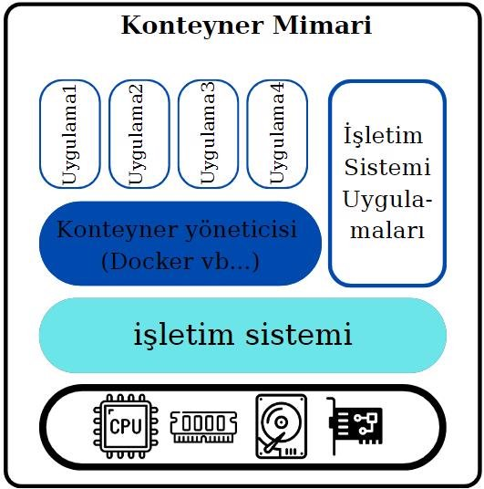
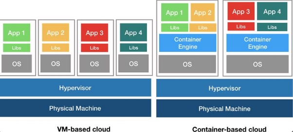
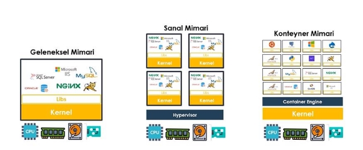

:house:[Ana Sayfa](https://github.com/tugbakorkut16/MyArticles)
 
 **DOCKER**

Merhaba arkadaşlar, sizlere Docker ile ilgili öğrendiklerimi özet olarak paylaşmaya çalışacağım. Bu yazımda, “Konteyner nedir? Neden İhtiyaç duyarız?, Docker nedir?, Ne işe yarar? ” gibi sorulara cevap vermeye çalışacağım.

D

ocker dan önce geleneksel yöntemlerle bir uygulamayı çalıştırmak istediğimizde öncelikle bir bilgisayar üstüne işletim sisteminizi kurup; daha sonra da bunun üstüne tüm gerekli kütüphaneleri ekleyip ve ardından da bunun üstüne uygulamamızı kurmamız yeterliydi.

Sanallaştırma öncesi mimari tüm kaynakları tek bir işletim sistemi ile kullanabildiğimiz , ihtiyaç duyduğumuz uygulamaları bu sunucu üzerine yüklediğimiz mimaridir. Bu mimaride aynı uygulamanın farklı sürümlerini aynı sistem üzerinde çalıştırmak mümkün değildi.

İkinci bir uygulama çalıştırmak istediğimizde; ikinci uygulamayı aynı bilgisayar üzerine kurabilsek de bu durum uygulamalarımızın birbirinden etkilenmeden çalışabilmesi için çok sağlıklı değildi.

Daha sonra hayatımıza **Sanallaştırma (hypervisor) teknolojiisi** girdi.

İki uygulamanın izole çalışması adına bir bilgisayara “sanallaştırma yazılımını”, ara katman olarak kurup ve ardından da bu sanallaştırma yazılımı sayesinde iki tane sanal makine oluşturuyor ve Linux işletim sistemini bunların üzerine kuruyor daha sonra uygulamalarımızı bu iki sanal makine üzerinde kurarak birbirinden izole bir şekilde çalıştırabiliyorduk. Bu çözüm zamanla yaygın bir kullanım haline gelse de yine de en ideal çözüm değildi.

Sanallaştırma mimarisi(Hypervisor)

Çünkü; bu yöntem her uygulama için ayrı ayrı birer fiziksel makine kurmaktan çok daha verimli olsa da, bu sanallaştırılmış ortamlarda da hala kaynak israfı söz konusuydu. Çünkü işletim sisteminin temel işlerini yapması için de belirli bir kaynak kullanması gerekir.

Yani bir fiziksel makinenin üstüne kurduğunuz bir tane sanal makinenin içine kurduğunuz işletim sistemi, sırf kendi temel işlerini yapabilmek için kaynak harcıyor ve bu da oluşturacağımız her sanal makine için ayrı kaynak kullanmamız ve bu oluşturduğumuz sanal makinelerin yönetilmesi anlamına geliyordu.

Her sanal makinenin içinde kendi işletim sistemi vardır. Bu yüzden temel kaynakların daha fazla kullanımına neden olur. Sanal makinelerin işletim sistemini başlatması gerektiğinden, açılması da dakikalar sürer. Bu da aynı zamanda zaman kaybına da neden olur.

2010 lara doğru hayatımıza giren **Konteyner** teknolojisi ile bunlara çözüm olarak uygulamaları aynı sistem üstünde, birbirlerinden izole şekilde çalıştırabiliyoruz.

**Konteyner Nedir?**

Konteyner, bir uygulamanın ihtiyaç duyulan tüm bağımlılıklar, kütüphaneler ve diğer tüm nesnelerle birlikte paketlenerek standart hale getirilmesidir.

Oluşturulan bu **Konteynerlar,** bir bilgisayar ortamından diğerine tüm bağımlılıklarla birlikte güvenli bir şekilde taşınabilmektedir.

**Konteynerlar**, izole edilmiş kendi ortamları ve süreçleri olan imajların çalışan örnekleridir.

Tüm işletim sistemlerinde paylaşılan ortak bir Linux çekirdeğine ve işletim sistemlerini birbirinden ayıran bazı özel yazılımlara olanak sağlar. Docker Conteinerlar işletim sistemi çekirdeğini paylaşır.

**Docker Nedir?**

D

**ocker konteyner** teknolojisi 2013 yılında açık kaynaklı bir Docker Engine olarak hayatımıza girmiştir. Yazılımcıların kodlarını kendi sistemlerinde derleyip çalıştırmasından, bu kodu production ortamına taşımaya kadar olan sürecin her noktasında birçok avantaj ve kolaylık sağlamış ve zamanla bu alanda vazgeçilmez bir teknoloji haline gelmiştir.

**Docker,** uygulamalarınızı hızla derlemenize, test etmenize ve dağıtmanıza imkan tanıyan bir yazılım platformudur. Docker, yazılımları kitaplıklar, sistem araçları, kod ve çalışma zamanı dahil olmak üzere yazılımların çalışması için gerekli her şeyi içeren **container** adı ile standart birimler halinde paketler. Docker’ı kullanarak her ortama hızla uygulama dağıtıp uygulamaları ölçeklendirebilir ve kodunuzun çalışacağından emin olabilirsiniz.

Docker in temel amacı, uygulamaları paketlemek ve konteyner haline getirmek, bunları göndermek ve istediğiniz yerde istediğiniz kadar çalıştırmaktır. Bu da bizi sanal makineler ve konteynerlar arasındaki farklara getirir.

Aynı işletim sistemini paylaşmaları dışında, sanal makineler gibi kendi süreçlerine veya hizmetlerine , kendi arayüzlerine ve kendi bağlantılarına sahip olabilirler.

Kendi imajınızı oluşturabilir ve bunu Dockerhub deposuna göndererek herkese açık hale getirebilirsiniz.

Linux işletim sistemine ait bir fiziksel makine ya da sanal makineye sahipseniz Docker’ı rahatlıkla kurabilirsiniz.

Docker’in kendi sitesinden <https://docs.docker.com/engine/> kendi işletim sisteminize göre nasıl install edeceğinizi öğrenebilirsiniz.

Sanallaştırma teknolojisi ile , mevcut fiziksel kaynakların sanal sunucu sistemlerini daha verimli kullanılmasını sağlayan bir teknolojidir. Ancak bu teknolojide her bir sanal sunucu kendi işletim sistemlerini barındırır ve uygulamalar da bu işletim

sistemleri üzerinde çalışmak zorundadır. Yani ne kadar sanal makine çalıştırırsanız, fiziksel bir sunucunun üzerinde bir hipervizör ve çalıştırdığınız sanal makine kadar ayrı işletim sistemi bulunur.

Bunun aksine, Konteyner ile ne kadar uygulama çalıştırırsanız çalıştırın. Bir sunucuda tek bir işletim sistemi çalıştırır ve her konteyner işletim sistemi çekirdeğini diğer konteynerlar ile paylaşır. İşletim sisteminin paylaşılan kısımları salt okunur dur, her container veri yazmak için kendi erişilen alanlarına sahiptir. Bu, konteynerların çok daha hafif olduğu ve sanal makinelere göre çok daha az kaynak kullandığı anlamına gelir.
                                                                                                                                :house:[Ana Sayfa](https://github.com/tugbakorkut16/MyArticles)
