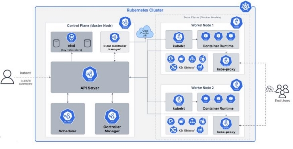
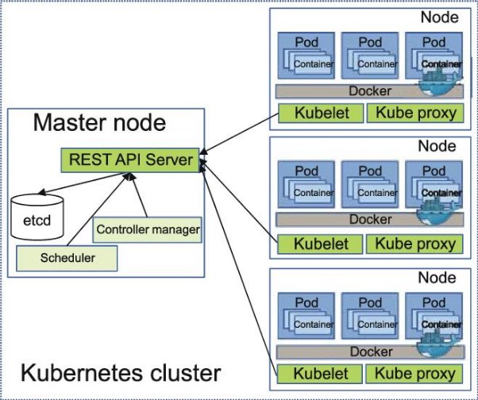

[:house:Ana Sayfa](https://github.com/tugbakorkut16/MyArticles)

#Kubernetes de Pod Objesinin Yaşam Hikayesi

**M**erhaba arkadaşlar bu yazımda sizlere kubernetes in en temel objesi olan Pod ve yaşam döngüsünden ve bu arada Clusterda neler olduğundan bahsedeceğim.

Kubernetes üzerinde deploy ettiğimiz, çalıştırdığımız, koşturduğumuz şeylere **Obje** diyoruz.

Kubernetes üstünde oluşturabileceğimiz ve de yönetebileceğimiz en küçük ve en temel birim P**od’**dur. **Pod** içerisinde bir ya da birden fazla obje barındırabilen en temel Kubernetes Objemizdir.

Kubernetes’de biz Docker’da olduğu gibi direkt olarak container çalıştıramayız. Aslında çalıştırdığımız şey container olsa da **Kubernetes’**de bunu, Pod olarak tanımlayıp deploy ederiz. Örneğin “docker container run ” diyerek docker üstünde bir container oluşturabildiğimiz gibi

*docker container run [OPTIONS] IMAGE [COMMAND] [ARG...]*

Kubernetes’de de “kubectl run” diyerek bir pod oluşturabiliriz.

*$ kubectl run NAME --image=image [--env="key=value"] [--port=port] [--dry-run=server|client] [--overrides=inline-json] [--command] -- [COMMAND] [args...]*

**kubectl** üzerinden **Kubernetes Api’**ye; içinde belirttiğimiz imajı kullanarak oluşturacağın bir container bulunan pod oluştur , özellikleri şunlar olsun, ismi şu olsun, şu etiketleri alsın vs… dediğimizde kubernetes bunu oluşturmaya başlar.

Kubernetes altında her Pod’a bir **Unique Id** oluşturulur ve sıradaki boş **Ip adresi** atanır.

**Api Server**, bizim Pod a tanımladığımız bilgilere, **Unique Id** ve **Ip** adresi gibi bilgileri ekleyerek bir pod tanımı yapar ve **etcd** veri tabanına kaydeder.

K8s Architecture

**Kube Scheduler** ,sürekli **etcd**yi gözler ve herhangi bir **Worker Node** ataması yapılmamış **Pod** tanımı görürse o Pod’ un çalışması için uygun bir **Worker Node** seçer ve bu bilgiyi **Pod** tanımına ekler. Seçilen **Worker Node** üzerinde çalışan **kubelet** servisi de bu **etcd**yi sürekli gözlediği için bu Pod tanımını hemen fark eder ve bu tanımda belirtilen Pod ve içindeki Container, o **Worker Node** üstünde oluşturulur.

$ kubectl run NAME --image=image [--env="key=value"] [--port=port] [--dry-run=server|client] [--overrides=inline-json] [--command] -- [COMMAND] [args...]

Podlarımızı yukarıda olduğu gibiimperative şekilde oluşturabildiğimiz gibi “json file” veya “yaml file” ile de declarative şeklinde oluşturabiliyoruz. Declarative yöntemler, bilgilerin daha düzenli olmasını sağlar. Oluştururken ve değişiklik yaparken de kolaylık sağlaması açısından çoğunlukla bu şekilde kullanılır.

örnek pod.yaml file

Daha sonra aşağıdaki gibi “kubectl apply” komutu ile bu dosyayı Kubernetes Cluster a göndeririz.

kubectl apply -f https://k8s.io/examples/pods/simple-pod.yaml

Kubernetes Api Server bu Yaml dosyasını alır, bu dosyada bizim belirttiğimiz ayarların yanında varsayılan olarak set edilmiş ayarları ekler, poda bir unique **Id** atar ve bu bilgileri **etcd ye** kaydeder. Buradan itibaren Pod oluşmaya başlar ve yaşam döngüsünün ilk aşaması olan **Pending** aşamasına geçer.

-Şimdi Podun yaşam döngüsünde izlediği yolda aşama aşama **Kubernetes Cluster** da neler oluyor öğrenelim

Kubernetes Cluster

**PENDİNG**

Eğer sistemde bir Pod’un durumu Pending’ de ise ; Pod ile ilgili gerekli tanımlamalar yapıldı ve veri tabanına (**etcd**) kaydedildi ama Pod henüz herhangi bir Node üstünde oluşturulmadı. **Kube Scheduler** sürekli gözlemlediği **etcd’**de yeni yaratılmış fakat herhangi bir Node ataması yapılmamış bir pod görürse **Pod’**un

çalışacağı en uygun Node’u seçer ve **etcd** deki pod objesine Node bilgisini ekler. Bu noktadan itibaren Pod yaşam döngüsünde **Creating** aşamasına geçer.

**CREATİNG**

Eğer **Kube Scheduler,** çeşitli sebeplerden dolayı pod için uygun Node bulamadıysa Creating aşamasına geçemez. Pending de takılı kalır. Creating aşamasında **Kubelet,** tıpkı **Kube Scheduler** gibi **etcd** yi gözler ve bulunduğu Node atanmış podları tespit eder. ilk olarak pod tanımında oluşturulması istenen Containerlara bakıp bu Containerların oluşturulacağı imajları DockerHub dan çekmeye başlar. Eğer imaj isimlerinin yanlış yazılması gibi nedenlerle imajı indiremediyse **İmagePullBackOff** aşamasına geçer. Bu aşamada sürekli indirme işlemini tekrarlar. Eğer imajı düzgün çekebildiyse **Running** aşamasına geçer.

**RUNNİNG**

Bu aşamada **kubelet,** o Node da bulunan Docker Engine ile haberleşir ve ilgili Containerlarin oluşturulmasını sağlar ve Containerlar çalışmaya başlar. Artık Pod umuz oluştu. 😊🤗 Hayırlı olsun…

Bir Pod, bir Noda atandığında, Pod durana veya sonlandırılana kadar o Node üzerinde çalışır .

Container imajlarında, container oluşturulup çalıştırıldığı zaman başlatılması belirlenen bir uygulama bulunur. Bu uygulama çalıştığı sürece Container da çalışır durumda olur. uygulama çalışmayı bırakırsa Container da durdurulur. uygulamanın çalışmayı bırakması da 3 şekilde olur.

- uygulama görevini tamamlayıp hata vermeden kapanır.
- kullanıcı ya da sistem uygulamaya kapanma sinyali gönderir ve hata vermeden kapanır.
- hata verir, çöker veya hata kodu oluşturarak kapanır.

Pod tanımı içinde, Podun içinde oluşturulacak Containerlara bir [**RestartPolicy**](https://docs.docker.com/config/containers/start-containers-automatically/) tanımı yapılır. **[RestartPolicy**](https://docs.docker.com/config/containers/start-containers-automatically/)** 3 değer alabilir. Bunlar; Always, On-failure, Never

- **Always :** Varsayılan (Default) değerdir. Podun içerisinde oluşan Container hata vererek yada hata vermeden kapanırsa **kubelet** o Container i yeniden başlatır.
- **On-failure:** sadece hata alıp kapanırsa yeniden başlatılır.
- **Never :** Hiç bir durumda Container yeniden başlatılmaz.

**SUCCEEDED**

Eğer Container lar hata vermeden doğal olarak kapanırsa ve [**RestartPolicy**](https://docs.docker.com/config/containers/start-containers-automatically/) de Always olarak set edilmediyse Pod status Succeeded a döner ve Pod başarılı bir şekilde yaşam döngüsünü tamamlar.

**FAİLED**

**RestartPolicy nin** Always olarak set edilmediyse, Containerlardan birisi hata verip kapandıysa Pod status Failed olarak işaretlenir ve yaşam döngüsünü bu şekilde tamamlar .

pod yaşam döngüsü

**CrashLoopBackOff**

**RestartPolicy nin** Always olarak set edilirse ; Containerlar hata vererek de kapansa normal de kapansa yeniden başlatılacağından **Running** state geçer**. A**ma belirli aralıklarla yeniden başlatma

işlemi devam ediyorsa bu sefer **CrashLoopBackOff** a geçer. Müdahale edip sorunu ortadan kaldırıp ,10 dk sorunsuz çalışırsa **kubelet** bu Pod u **CrashLoopBackOff** dan **Running e** döndürür.🙌🙌🙂

[:house:Ana Sayfa](https://github.com/tugbakorkut16/MyArticles)
