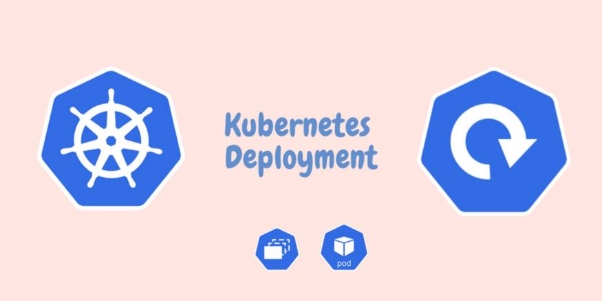
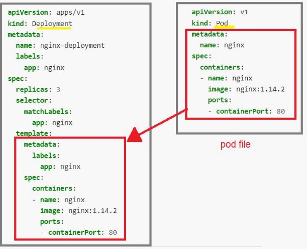

[:house:Ana Sayfa](https://github.com/tugbakorkut16/MyArticles)
 
 **Kubernetes Deployment**

Merhaba, bu yazımda ;

Deployment nedir? Uygulamalarımızı, production ortamda nasıl Deploy ederiz? Sorularına cevap vermeye çalışacağım.

***Deployment**: Bir veya birden fazla podu, bizim belirlediğimiz, yani desired state e göre oluşturan sonrasında bu desired state’ yi yani istenilen durumu mevcut durumla(*current state) *sürekli karşılaştırıp gerekli düzeltmeleri yapan bir obje tipidir. Bizler deployment objesi oluşturmak için tanım yapar ve bu tanımın içinde, oluşturmak istediğimiz podun hangi özelliklere sahip olacağını ve kaç adet olacağını belitiriz. Bu deployment objesi oluştuğu zaman, tanımladığımız özelliklerde ve adette pod oluşturulur.*

Deployment bize birden fazla podu tek seferde ve uygulamamızda kesinti olmadan güncelleme kolaylığı sağlar.

Aşağıda nginx imajından 3 adet pod oluşturan örnek bir tanım dosyası (yaml file) bulunmaktadır.

[nginx-deployment.yaml ](https://raw.githubusercontent.com/kubernetes/website/main/content/en/examples/controllers/nginx-deployment.yaml)**apiVersion**: apps/v1

**kind**: Deployment **metadata**:

**name**: nginx-deployment **labels**:

**app**: nginx

**spec**:

**replicas**: 3

**selector**:

**matchLabels**:

**app**: nginx **template**:

**metadata**:

**labels**:

**app**: nginx

**spec**:

**containers**:

- **name**: nginx

**image**: nginx:1.14.2 **ports**:

- **containerPort**: 80

Bu Dosya dört bölümden oluşmaktadır. Bunlar ;

- apps/v1 olan bir -**apiVersion**,
- **(türü)** Deployment olan -**kind**
- name ve labels(etiketleri) olan -**metadata** ,
- replicas, selector ve template olan -**spec** tir.

Yukarıda görüldüğü gibi Template in içinde bir pod tanımı vardır. Dosyayı hazırladığımızda ;

kubectl apply -f nginx-deployment.yaml

komutunu ile tanım dosyasını çalıştırırız. Yeni oluşturulan deployment i görmek için ;

kubectl get deployments

komutunu çalıştırırız. Deployment oluştu ise

NAME               READY   UP-TO-DATE   AVAILABLE   AGE nginx-deployment   3/3     3            3           18s

bu şekilde bir çıktı alırız. Eğer deployment hala oluşturuluyor ise aşağıdaki gibi bir çıktı alırız.

NAME               READY   UP-TO-DATE   AVAILABLE   AGE nginx-deployment   0/3     0            0           1s

Burada dikkat edeceğimiz nokta, Deployment in üç podu oluşturduğu ve tüm podların güncel ve kullanılabilir olmasıdır.

-Eğer Deploy ettiğimiz Pod lar Ready olmuyorsa

kubectl describe pods

komutu ile Deployment imizda ki herhangi bir Podu incelerek **Events** kısmından hatanın ne olduğunu öğrenebiliriz. Örneğin genel olarak yapılan hatalardan biri; deploy ederken imaj isminı hatalı girmek. İmaj ismi hatalı girilirse Kubelet imajı çekemez [İmagePullBackOff](https://medium.com/@arslantobe/kubernetes-de-pod-objesinin-ya%C5%9Fam-hikayesi-faf90e67ee5a) hatası verir. [Bir önceki yazımda](https://medium.com/@arslantobe/kubernetes-de-pod-objesinin-ya%C5%9Fam-hikayesi-faf90e67ee5a) da bahsettiğim gibi Running e geçemez.

-Oluşturulan tüm objeleri görmek için ise ;

kubectl get all

komutunu kullanabilirsiniz. Bu durumda sıralı olarak Deoployment ,replicaset ve ardından üç adet Pod un oluştuğunu görebilirsiniz.

NAME               READY   UP-TO-DATE   AVAILABLE   AGE nginx-deployment   3/3     3            3           18s

NAME                          DESIRED   CURRENT   READY   AGE nginx-deployment-75675f5897   3         3         3       18s

NAME                                READY     STATUS RESTARTS   AGE       LABELS

nginx-deployment-75675f5897-7ci7o   1/1       Running   0 18s       app=nginx,pod-template-hash=3123191453

nginx-deployment-75675f5897-kzszj   1/1       Running   0 18s       app=nginx,pod-template-hash=3123191453

nginx-deployment-75675f5897-qqcnn   1/1       Running   0 18s       app=nginx,pod-template-hash=3123191453

- Diyelim ki bu podlardan birini

kubectl delete pod nginx-deployment-75675f5897-7ci7o

komutunu girerek sildim. Deployment Controller, desired state e bakar üç Pod olması gerektiğini görür. Sonra Cluster’a gider ve 2 pod olduğunu görür. hemen yeni bir pod oluşturup desired state ile current state yi eşitler.

- Eğer biz imperative yöntemle Deployment i Update etmek istersek, örneğin ;

kubectl set image deployment/nginx-deployment nginx=nginx:1.16.1

komutu ile nginx 1.14.2 olan image versionunu 1.16.1 olan versionu ile değiştirdiğimizde aşağıdaki Output ile imajın update olduğunu görebiliriz.

deployment.apps/nginx-deployment image updated

Deployment güncellendiğinde, default olarak Podların %75 inin çalışmasını sağlar ve sadece %25 ini günceli ile değiştirmek üzere kapatır. Yani 4 podumuz varsa önce birini kapatıp yerine güncellediğimiz imaj a sahip bir pod çalıştırır. Hepsini güncelleyene kadar bu şekilde devam eder. Böylece uygulamamız güncellenirken kesintiye uğramaz.
 
[:house:Ana Sayfa](https://github.com/tugbakorkut16/MyArticles)
Oluşturduğumuz Deployment’ı

kubectl delete deployment

veya

kubectl delete -f nginx-deployment.yaml

komutları ile silebiliriz.

Bir sonraki yazımda görüşmek üzere 󰢨
