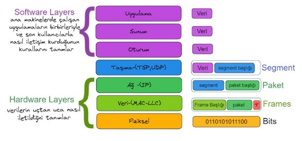

 :house:[Ana Sayfa](https://github.com/tugbakorkut16/MyArticles)
 
 **OSI REFERANS MODELİ**

Farklı marka donanım aygıtları ve farklı işletim sistemleri olan iki bilgisayar arasında iletişim nasıl gerçekleşir?

OSI öncesindeki dönemde, yalnızca bilgisayar donanımı üreten firmalar kendilerine özel ağ sistemleri geliştirip bunları bir paket halinde müşteriye sunuyorlardı. Bu ağların özellikleri, dışarıya kapalıydı, yalnızca o üreticinin donanımının bağlanmasına izin verecek biçimde tanımlanmıştı. Farklı üreticilerin birbirlerinin ağlarına entegre olabilmek için ortak bir standardın gerekliliği ortaya çıkmıştı.

1978 yılında ilk defa ortaya çıkarılan bu standart ile 1984 yılında yeni bir düzenleme yardımıyla OSI (Open System Interconnect) referans modeli olarak yayınlanmıştır. OSI (Open Systems Interconnection) modelini ISO (International Organization for Standardization) geliştirmiştir. Amaç iki bilgisayar arasındaki iletişimin nasıl olacağını tanımlamaktır. OSI, çeşitli üreticilerin

ürünlerinin ortak bağlanabileceği bir ağ için, bir sektör etkinliği olarak ortaya çıkmıştır. OSI Modeli, herhangi bir donanım ya da bilgisayar ağı tipine göre değişiklik **göstermemektedir.** OSI’nin amacı; ağ mimarilerinin ve protokollerinin bir ağ ürünü bileşeni gibi kullanılmasını sağlamaktır. OSI modeli 7 katmana ayrılmıştır.

Bu katmanlar şöyle sıralanmaktadır:

**1- Fiziksel Katman (Physical Layer)**

**2- Veri Bağı Katmanı (DataLink Layer)**

**3- Ağ Katmanı (Network Layer)**

**4- Taşıma(İletim)Katmanı (Transport Layer) 5- Oturum Katmanı (Session Layer)**

**6- Sunum Katmanı (Presantation Layer)**

**7- Uygulama Katmanı (Application Layer)7** Her katmanda ayrı ayrı protokoller belirlenmiştir.

İki bilgisayar arasındaki iletişimde katmanlar sırasıyla iletişim kurarlar; veriler katmanlar arasında ilerlerken, her bir katmanda veriye belirli bilgiler eklenir ve bir alt katmana iletilir bu işleme **Kapsülleme(Encapsulation)** denir.

Veri Transferi

**Veri alt katmanlara iletilirken iletim şekli şu şekilde olur:**

Veri (data) halinde alınan bilgi,

- taşıma katmanında Segment(bölüm) adı verilen birimlere ayrılır. Bu şekilde veri alıcı makinede tekrar bir araya getirilirken doğru sıralanması sağlanmış olur.
- Ağ katmanına Segment şeklinde gelen verilere burada adres bilgileri eklenir; böylece segmenler paket haline dönüşür.
- Veri-bağlantı katmanında paketlere MAC adresleri eklenerek çerçeve (Frame) adını verdiğimiz yapı oluşur. En son aşama olarak
- Fiziksel katmana gelen Frame’ler burada bir Bit dizisine dönüştürülerek iletime hazır hale getirilir.

Karşı tarafa gönderilecek olan Verinin iletimi üst katmandan alt katmana doğru olur. Verinin kablo ile iletimi fiziksel katman tarafından gerçekleştirilir.

Veri hedefe ulaştığında hedef bilgisayarda ise önce fiziksel katman ile karşılanan veri en alt katmandan üst katmanlara doğru hareket eder. Bu harekette her bir katmanda eklenmiş olan bilgiler çıkarılır. Bu işleme de **Kapsül açma (De-EnCapsulation)** denir.

Her katmanda verilere ilave bilgiler eklenerek ya da çıkarılarak oluşturulan yeni biçimlere “**PDU**” yani **Protokol Veri Birimi(Protocol Data Unit)** denir.

Veri Transferi

**7. Uygulama Katmanı**

Uygulama katmanı bilgisayar uygulaması ile ağ arasında bir arabirim sağlar. OSI katmanları arasında sadece bu katman diğer katmanlara servis sağlamaz. Uygulamaların ağ üzerinde çalışması sağlanır.

Uygulama katmanı ağ servisini kullanacak olan programdır. Bu katman kullanıcıların gereksinimini karşılar. **SSH, telnet, FTP, TFTP, SMTP, SNMP, HTTP, DNS** protokolleri ve tarayıcılar bu katmanda çalışır.

E-posta ve Veritabanı gibi uygulamalar bu katman aracılığıyla yapılır.

**6. Sunum Katmanı**

Sunum katmanının en önemli görevi yollanan verinin karşı bilgisayar tarafından anlaşılacak şekilde çevrilmesidir. Bu sayede farklı programların birbirlerinin verisini kullanabilmesi mümkün olur.

Sunum katmanı uygulama katmanına verileri yollar daha sonra bu katmanda verinin yapısı, biçimi ile ilgili düzenlemeler yapılır, verinin formatı belirlenir. Ayrıca verinin şifrelenmesi, açılması, sıkıştırılması da bu katmanda yapılır.

GIF, JPEG, DOC, MP3, TIFF, EBCDIC, ASCII vb. bu katmanda çalışır.

**5. Oturum Katmanı**

Bir bilgisayar, birden fazla bilgisayarla aynı anda [i](https://tr.wikipedia.org/wiki/%C4%B0leti%C5%9Fim)letişim içinde olduğunda, gerektiğinde doğru bilgisayarla konuşabilmesini sağlar.

Ağda iki uygulamanın haberleşmesini sağlar. Uygulamalar arasındaki bağlantıları kurar, yönetir ve sonlandırır. Örneğin bir [i](https://tr.wikipedia.org/wiki/Internet_Explorer)nternet Explorer programı ile Web server uygulamasının oturum kurmalarını birbirleri ile ön konuşmalar yapmalarını sağlar. İki uygulama birbirini fark edecek ve aralarında bir diyalog başlatacaktır.

Bu katman yardımı ile farklı bilgisayarlardaki kullanıcılar arasında oturumlar kurulması sağlanır. Bu işlem oturumların kurulmasını, yönetilmesini ve bitirilmesini içerir.

Özetle bu katman, öncelikle uygulamaların verilerini birbirinden ayırarak yönetir. Örneğin, masaüstünüzde aynı anda birden fazla web tarayıcısı oturumu, oturum katmanı yardımıyla gerçekleştirilir.

NetBIOS, RPC, Named Pipes ve Sockets gibi protokoller bu katmanda çalışır.

**4. Taşıma Katmanı**

Taşıma katmanı alt katmanlar ve üst katmanlar arasında geçit görevini görür. Alt katmanlar verinin ne olduğuna bakmandan karşı tarafa yollama işini yaparken üst katmanlar da kullanılan donanım ile ilgilenmeden verinin kendisi ile uğraşabilirler.

Taşıma katmanı üst katmanlardan gelen veriyi ağ paketi boyutunda **bölümlere(Segmentlere)** ayırır. Bu katmanda verilere, “S**egment başlığı**” (Taşıma katman başlığı) eklenerek bölüm(**segment**) halinde taşınır. Segment başlığının içerisinde veri gönderen uygulamanın portu ile verinin iletileceği uygulamanın portları bulunur. **TCP, UDP, SPX** protokolleri bu katmanda çalışır. Bu protokoller hata kontrolü gibi görevleri de yerine getirir.

Taşıma katmanı üst katmanlara taşıma servisi sağlar ayrıca ağın servis kalitesini artırır (QoS — Quality of Service).

Taşıma katmanı verinin uçtan uca iletimini sağlar. Verinin hata kontrolü ve zamanında ulaşıp ulaşmadığı kontrol edilir.

**3. Ağ Katmanı**

Ağ katmanı veri paketine farklı bir ağa gönderilmesi gerektiğinde yönlendiricilerin kullanacağı bilginin eklendiği katmandır. Bu katmanda verilere paket başlıkları eklenerek, **paket** olarak taşınır. Paket başlıklarının içerisine kaynak ve hedef adresleri eklenir.

Ağ katmanında iki istasyon arasında en ekonomik yoldan verinin iletimi kontrol edilir. Bu katman sayesinde verinin yönlendiriciler (router) aracılığıyla yönlendirilmesi sağlanır. Mantıksal adresler fiziksel adreslere çevirilir. Bu aşamada ağ trafiği, yönlendirme gibi işlemler de yapılır.

**IP protokolü** bu katmanda çalışır. Örnek olarak; Google erişmek istediğimizde, paket başlığının içerisine, hedef IP adresi olarak Google’ un IP adresi eklenir. Kaynak adresi olarak da kendi bilgisayarımızın adresi eklenerek paket oluşur.

Bu katmanda kullanılan diğer protokoller; IP, IPX, ARP, ICMP, Yönlendirme protokolleri olarak; RIP, BGP,EIGRP, OSPF örnek olarak verilebilir.

**2. Veri Bağlantı Katmanı**

Göndericinin girdi verisini veri çerçevelerine(Data Frame) bölerek sırayla iletmesini sağlayarak fiziksel katmanda oluşabilecek hataları da düzeltir. Her Frame’in teslimatından önce, başta bir başlık**(Head)** ve sona bir kuyruk**(Trailer**) eklenir. Trailer, Hata tespiti için kullanılır ve çerçevenin sonunu işaretler. Bu mekanizma kullanılarak çerçevelerin çoğaltılması da önlenir Bu katmanda çoğunlukla **Ethernet** olarak bilinen erişim yöntemleri çalışır. Bu erişim yöntemleri verileri, kendi protokollerine uygun olarak

işleyerek iletirler. Veri bağlantısı katmanı, [a](https://tr.wikipedia.org/wiki/Fiziksel_katman)ğ katmanından alınan veri paketlerini veya bir attaki [f](https://tr.wikipedia.org/wiki/A%C4%9F_katman%C4%B1)iziksel katmandan aldığı bitleri **Frame** adı verilen belirli parçalara bölünmüş bir formata dönüştürür. Frame’ler verileri belli bir kontrol içinde göndermeyi sağlayan paketlerdir.

Veri bağlantı katmanı ağ üzerindeki diğer bilgisayarları tanımlama, kablonun o anda kimin tarafından kullanıldığının tespiti ve fiziksel katmandan gelen verinin hatalara karşı kontrolü görevini yerine getirir.

Veri bağlantısı katmanı iki alt bölüme ayrılır:

- Media Access Control (MAC)
- Logical Link Control (LLC)

MAC alt katmanı veriyi hata kontrol kodu(CRC), alıcı ve gönderenin MAC adresleri ile beraber paketler ve fiziksel katmana aktarır. Alıcı tarafta da bu işlemleri tersine yapıp veriyi veri bağlantısı içindeki ikinci alt katman olan LLC’ye aktarmak görevi yine MAC alt katmanına aittir.

LLC alt katmanı bir üst katman olan ağ katmanı için geçiş görevi görür. Protokole özel mantıksal portlar oluşturur(Service Access Points, SAPs). Böylece kaynak makinada ve hedef makinada aynı protokoller iletişime geçebilir(örneğin TCP/IP←>TCP/IP). LLC ayrıca veri paketlerinden bozuk gidenlerin(veya karşı taraf için alınanların) tekrar gönderilmesinden sorumludur. Flow Control yani alıcının işleyebileceğinden fazla veri paketi gönderilerek boğulmasının engellenmesi de LLC’nin görevidir.

Veri bağlantısı katmanında bulunan bağlantı cihazları şunları içerir; **Network adapter, Bridge, Basic switch, Wireless Access Point (AP)**

Ayrıca switch (anahtar), 2.katmanda çalışan bir cihazdır. Çünkü 2. katmanda tanımlı MAC adreslerini algılayabilirler ve bir porttan gelen veri paketini (yine elektrik sinyalleri halinde) sadece gerekli olan porta (o porttaki makinanın MAC adresini bildiği için) yollayabilirler. MAC adresleri Local Networkte çalışır. Yani WAN’a çıkmaz. Örneğin Web sayfasına erişecek olan frame içerisinde; hedef MAC adresi olarak bilgisayarın bulunduğu Local ağdaki Gateway’in (Çıkış kapısı olarak;Modem,Router gibi) MAC adresi ve , kaynak MAC adresi olarak da bilgisayarımızın MAC adresi bulunur.

**1. Fiziksel Katman**

Fiziksel katman verinin kablo üzerinde alacağı yapıyı tanımlar. Veriler bit olarak iletilir. Bu katman bir ve sıfırların nasıl elektrik, ışık veya radyo sinyallerine çevrileceğini ve aktarılacağını tanımlar. Bakır kablo kullanılıyorsa elektrik olarak, Fiber kablo kullanılıyorsa Işık olarak gönderilir. Gönderen tarafta fiziksel katman bir ve sıfırları elektrik sinyallerine çevirip kabloya yerleştirirken, alıcı tarafta fiziksel katman kablodan okuduğu bu sinyalleri tekrar bir ve sıfır haline getirir. Elektirik veya Işık varsa “1” yoksa “0” şeklinde yazılarak gönderilir.

Fiziksel katmanda çalışan cihazlar şunlardır:

- **Transceiver** — ağ ortamı üzerinden sinyal gönderen ve alan bir ağ arabiriminin parçası.
- **Media Converter** — bir medya sinyal türünü diğerine dönüştürür.
- **Hub** — bir yıldız topolojisinde kablolanmış düğümler için merkezi bağlantı noktası olarak dağıtılan bir çok bağlantı noktalı tekrarlayıcı. Bu cihazlar gelen veriyi bir takım elektrik sinyalleri olarak gören ve bu sinyalleri çoğaltıp, diğer portlarına gönderen bir cihazdır.
- **Modem** — dijital ve analog sinyal aktarımlarını dönüştüren bir cihaz

**TCP/IP ile OSI arasındaki Farklar**

- [TCP/IP](https://tr.wikipedia.org/wiki/TCP/IP) , haberleşme görevini karmaşık bir iş olarak niteleyerek daha basit alt görevlere böler. Her bir alt görev diğer alt görevler için belirli servisler sunar ve diğer alt görevin servislerini kullanır. OSI modeli de aynı kavramı kullanır ,ancak OSI modelinde her bir katmandaki protokollerin özellikleri ve birbiri ile ilişkileri kesin bir dille tanımlanmıştır. Bu özellik OSI modeli ile çalışmayı daha verimli kılar.
- OSI modelinde katmanların görevlerinin kesin bir şekilde belirlenmiş olması yeni bir protokol geliştirmeyi kimi zaman güçleştirebilir.

[TCP/IP](https://tr.wikipedia.org/wiki/TCP/IP) ise böyle bir kısıtlama getirmediğinden, gerektiğinde yeni bir protokol mevcut katmanlar arasına rahatlıkla yerleştirilebilir.

- OSI modelinde gerekmeyen bir katmanın kullanılmaması gibi esnek bir yapıya izin verilmemektedir. [TCP/IP](https://tr.wikipedia.org/wiki/TCP/IP) ise katı kurallarla tanımlı olmadığından gereksinim duyulmayan katmanların kullanılmamasına izin verir. Örneğin uygulama katmanında olmasına rağmen doğrudan IP üzerinden kullanılabilen protokoller mevcuttur.

[**TCP/IP](https://tr.wikipedia.org/wiki/TCP/IP) **protokollere örnek olarak**, dosya alma/gönderme protokolü ([FTP](https://tr.wikipedia.org/wiki/FTP), File Transfer Protocol), Elektronik posta iletişim protokolü ([SMTP](https://tr.wikipedia.org/wiki/SMTP) Simple Mail Transfer Protocol), [TELNET ](https://tr.wikipedia.org/wiki/Telnet)protokolü (Internet üzerindeki başka bir bilgisayarda etkileşimli çalışma için geliştirilen \*login\* protokolü) verilebilir. Adını sıkça duyduğumuz WWW ortamında birbirine link objelerin iletilmesini sağlayan protokol ise Hyper Text Transfer Protocol ([HTTP](https://tr.wikipedia.org/wiki/HTTP)) olarak adlandırılmaktadır. [TCP/IP](https://tr.wikipedia.org/wiki/TCP/IP) protokolü aynı zamanda, diğer iletişim ağlarında da kullanılabilir. Özellikle pek çok farklı tipte bilgisayarı veya iş istasyonlarını birbirine bağlayan yerel ağlarda (LAN) kullanımı yaygındır.

                                                                                           m            :house:[Ana Sayfa](https://github.com/tugbakorkut16/MyArticles)
